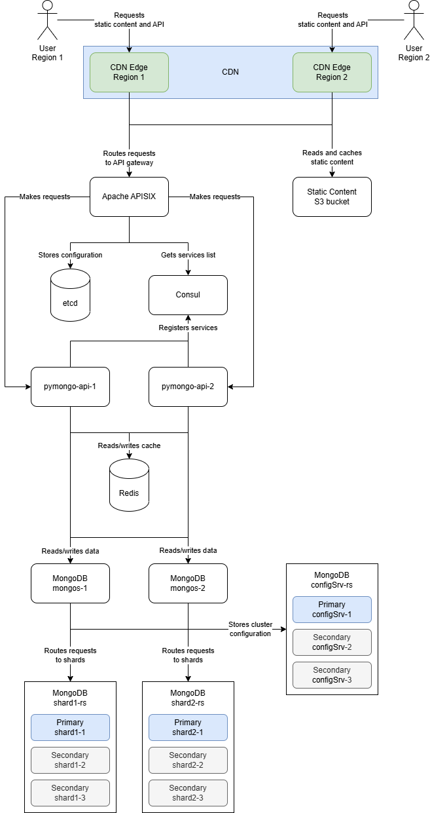

# Проектная работа

## Задания 1-6

**Инструкция по запуску:**

1. Перейти в директорию [sharding-repl-cache](sharding-repl-cache);
2. Запустить приложение следуя [инструкции](sharding-repl-cache/README.md).

**Итоговая схема:**

[](cdn.drawio)

## Задание 7. Схемы коллекций для шардирования данных

Коллекции и их атрибуты отражают состояние текущей системы.

Указанные индексы позволяют эффективно выполнять основные операции.

Шард-ключи выбраны в соответствии с рекомендациями, приведенными
в [документации](https://www.mongodb.com/docs/manual/core/sharding-choose-a-shard-key/).

### Коллекция orders

Коллекция хранит заказы клиентов.

#### Атрибуты

| Поле               | Тип            | Описание                            |
|--------------------|----------------|-------------------------------------|
| _id                | ObjectId       | Уникальный идентификатор заказа     |
| user_id            | ObjectId       | Идентификатор клиента               |
| placed_at          | Date           | Дата и время оформления заказа      |
| items              | Array          | Список заказанных товаров и их цена |
| items[].product_id | ObjectId       | Идентификатор товара                |
| items[].price      | Decimal128     | Цена товара                         |
| items[].quantity   | 64-bit integer | Количество товара                   |
| status             | String         | Статус заказа                       |
| total              | Decimal128     | Общая сумма заказа                  |
| geo_zone           | String         | Геозона заказа                      |

#### Шард-ключ и стратегия шардирования

| Кандидат  | Кардинальность | Частота     | Монотонное возрастание |
|-----------|----------------|-------------|------------------------|
| _id       | Максимальная   | Минимальная | Да                     |
| placed_at | Высокая        | Низкая      | Да                     |
| geo_zone  | Низкая         | Высокая     | Нет                    |
| user_id   | Высокая        | Низкая      | Нет                    |

Используем `user_id` с хэшированным шардированием.

Причины выбора:

* Равномерность распределения — хэш от `user_id` распределяет заказы равномерно по всем шардам. Создание новых заказов
  не замедляется из-за перегрузки одного чанка.
* Локальность данных — все заказы одного клиента хранятся на одном шарде. Для получения заказов клиента не нужен
  scatter-gather запрос.
* Достаточная эффективность поиска конкретного заказа — поиск конкретного заказа с указанием `user_id` + `_id`
  максимально эффективен. Если необходимо найти заказ по `_id` без `user_id`, то поиск будет произведен на всех шардах,
  но все еще будет использован индекс по `_id`.

#### Индексы

* `user_id` - шард-ключ, для поиска истории заказов конкретного пользователя.

#### Примеры команд

Создание индекса и шардирование коллекции:

```js
db.orders.createIndex({user_id: "hashed"})
sh.shardCollection("mobile_world.orders", {user_id: "hashed"})
```

Поиск заказов конкретного пользователя:

```js
db.orders.find({user_id: new ObjectId("<user-id>")})
```

Поиск конкретного заказа:

```js
// Наиболее эффективный вариант
db.orders.find({user_id: new ObjectId("<user-id>"), _id: new ObjectId("<order-id>")})

// Scatter-gather по шардам, но использует индекс по _id
db.orders.find({_id: new ObjectId("<order-id>")})
```

### Коллекция products

Коллекция хранит сведения о товарах.

#### Атрибуты

| Поле       | Тип        | Описание                                                       |
|------------|------------|----------------------------------------------------------------|
| _id        | ObjectId   | Уникальный идентификатор товара                                |
| name       | String     | Наименование                                                   |
| category   | String     | Категория товара                                               |
| price      | Decimal128 | Цена                                                           |
| stock      | Object     | Остаток товара в каждой геозоне (`{"EKB": 50, "KLD": 30}`)     |
| attributes | Object     | Дополнительные атрибуты (`{"color": "red", "size": "medium"}`) |

#### Шард-ключ и стратегия шардирования

| Кандидат         | Кардинальность | Частота     | Монотонное возрастание |
|------------------|----------------|-------------|------------------------|
| _id              | Максимальная   | Минимальная | Да                     |
| category         | Низкая         | Высокая     | Нет                    |
| price            | Высокая        | Низкая      | Нет                    |
| category + price | Высокая        | Низкая      | Нет                    |

Используем составной ключ: `category` с диапазонным шардированием + `price` с диапазонным шардированием.

Причины выбора:

* Равномерность распределения — комбинация полей `category` и `price` с диапазонным шардированием распределяет товары
  достаточно равномерно по всем шардам. Исключением могут являться категории, в которых очень много товаров с одинаковой
  ценой.
* Локальность данных — все товары одной категории и диапазона цены хранятся на одном шарде. Для поиска товаров в
  категории с фильтрацией по цене не нужен scatter-gather запрос.

#### Индексы

* `category` + `price` - шард-ключ, для поиска товаров по категориям и фильтрации по диапазону цен.

#### Примеры команд

Создание индекса и шардирование коллекции:

```js
db.products.createIndex({category: 1, price: 1})
sh.shardCollection("mobile_world.products", {category: 1, price: 1})
```

Поиск товаров по категориям и фильтрация по диапазону цен:

```js
db.products.find({category: "<category>", price: {"$gte": 100, "$lte": 200}})
```

Поиск конкретного товара:

```js
// Использует префикс шард-ключа и индекс по _id
db.products.find({category: "<category>", _id: new ObjectId("<product-id>")})

// Scatter-gather по шардам, но использует индекс по _id
db.products.find({_id: new ObjectId("<product-id>")})
```

### Коллекция carts

Коллекция хранит данные о текущих корзинах (как гостевых, так и пользовательских).

#### Атрибуты

| Поле               | Тип            | Описание                                                        |
|--------------------|----------------|-----------------------------------------------------------------|
| _id                | ObjectId       | Уникальный идентификатор корзины                                |
| user_id            | ObjectId       | Идентификатор пользователя                                      |
| session_id         | String         | Идентификатор сессии для гостей                                 |
| items              | Array          | Список товаров                                                  |
| items[].product_id | ObjectId       | Идентификатор товара                                            |
| items[].quantity   | 64-bit integer | Количество товара                                               |
| status             | String         | Статус корзины                                                  |
| created_at         | Date           | Дата и время создания                                           |
| updated_at         | Date           | Дата и время последнего обновления                              |
| expires_at         | Date           | Время удаления (TTL) - для автоматической очистки старых корзин |

#### Шард-ключ и стратегия шардирования

| Кандидат             | Кардинальность | Частота                                         | Монотонное возрастание |
|----------------------|----------------|-------------------------------------------------|------------------------|
| _id                  | Максимальная   | Минимальная                                     | Да                     |
| user_id              | Высокая        | Низкая, гостевые корзины на одном шарде         | Нет                    |
| session_id           | Высокая        | Низкая, пользовательские корзины на одном шарде | Нет                    |
| status               | Низкая         | Высокая                                         | Нет                    |
| user_id + session_id | Высокая        | Низкая                                          | Нет                    |

Используем `user_id` с диапазонным шардированием + `session_id` с диапазонным шардированием.

Причины выбора:

* Равномерность распределения — комбинация полей `user_id` и `session_id` с диапазонным шардированием распределяет
  корзины достаточно равномерно по всем шардам. Использование именно комбинации позволяет устранить проблемы, связанные
  с пустыми значениями отдельных полей. Важно отметить, что для эффективных targeted-запросов потребуется отправлять оба
  поля в фильтре.
* Эффективность операций — в ключе содержатся поля, поиск по которым должен быть достаточно быстрым для выполнения
  основных операций системы.

#### Индексы

* `user_id` + `session_id` + `status` - шард-ключ - префикс, для поиска текущей корзины пользователя или гостя;
* `expires_at` - с параметром `expireAfterSeconds` для автоматической очистки старых корзин.

#### Примеры команд

Создание индекса и шардирование коллекции:

```js
db.carts.createIndex({user_id: 1, session_id: 1, status: "hashed"})
sh.shardCollection("mobile_world.carts", {user_id: 1, session_id: 1})
```

Поиск текущей корзины:

```js
// Для пользователей
db.carts.find({user_id: new ObjectId("<user-id>"), session_id: null, status: "active"})

// Для гостей
db.carts.find({user_id: null, session_id: "<session-id>", status: "active"})
```

Добавление товара в корзину пользователя:

```js
db.carts.updateOne(
    {user_id: new ObjectId("<user-id>"), session_id: null, status: "active"},
    {$push: {items: {product_id: new ObjectId("<product-id>"), quantity: 1}}},
)
```

## Задание 8. Выявление и устранение "горячих" шардов

Из-за одной категории произошла перегрузка одного из шардов MongoDB, так как 70% запросов приходилось именно на эти
товары. Поэтому сейчас нужно разработать стратегию, как выявлять и устранять такие «горячие» шарды, а ещё предложить
метрики мониторинга, чтобы в будущем можно было предотвращать такие ситуации. Не забудьте учесть, что товары из
популярных категорий могут создавать непропорциональную нагрузку на отдельные узлы.

### Метрики для отслеживания состояния шардов

#### Распределение документов по шардам и балансировщик

Команда для получения данных:

```js
sh.status()
```

Блок `shardedDataDistribution` - распределение документов по шардам.

* `numOwnedDocuments` - общее количество документов в шарде. При диапазонном шардировании могут присутствовать перекосы.
* `ownedSizeBytes` - общий размер данных в шарде. При диапазонном шардировании могут присутствовать перекосы.
* `numOrphanedDocs` - количество документов, оставшихся после миграций. При отсутствии проблем, должно быть нулевым.

Блок `databases` - информация о шардированных базах данных.

* `chunkMetadata` - количество чанков коллекции в различных шардах. Сильный перекос — сигнал, что балансировщик не
  справляется, либо ключ не приводит к достаточно равномерному распределению.
* `chunks` - детальная информация о распределении ключей по чанкам. Большие диапазоны в рамках одного шарда или
  выбивающиеся промежутки между диапазонами сигнализируют о недостаточно равномерном распределении.

Блок `balancer` - состояние балансировщика, который распределяет документы по шардам.

* `Failed balancer rounds in last 5 attempts` - количество ошибок балансировки за последние 5 попыток. Если отличается
  от нуля — требуется исследование проблем.

#### Статистика операций

Команда для получения данных на каждом шарде:

```js
db.serverStatus()
```

* `opcounters` - количество выполненных операций;
* `opLatencies` - задержка операций;
* `locks` - ожидания блокировок.

Возвращаемые данные полезны для мониторинга производительности БД.

### Механизмы автоматического перераспределения данных

#### Балансировщик

Для автоматического перераспределения документов между шардами, в MongoDB существует балансировщик. Он перемещает чанки
между шардами.

Убедиться в том, что балансировщик включен, можно командой

```js
sh.getBalancerState()
```

Изменить размер копируемых чанков для коллекции можно командой

```js
db.adminCommand({configureCollectionBalancing: "mobile_world.products", chunkSize: 256}) // по умолчанию 128 мегабайт
```

Принудительно запустить балансировку можно командой

```js
sh.startBalancer()
```

#### Изменение ключа шардирования

Для долгосрочного исправления проблемы с распределением данных по шардам, можно изменить ключ шардирования.

Один из вариантов нового ключа - `{category: 1, price: 1, _id: "hashed"}`. Добавление `_id` позволяет повысить
кардинальность и более равномерно распределить данные по шардам.

Изменить ключ шардирования можно командой

```js
sh.reshardCollection("mobile_world.products", {category: 1, price: 1, _id: "hashed"})
```

Проверить прогресс можно командой

```js
db.adminCommand({currentOp: true, type: 'op', 'command.reshardCollection': {$exists: true}})
```

## Задание 9. Настройка чтения с реплик и консистентность

Рассмотрим операции чтения из коллекций MongoDB и использование различных реплик для этих операций.

### Сводная таблица

| Коллекция | Операция                                   | Read Preference     | Read Concern | Задержка репликации |
|-----------|--------------------------------------------|---------------------|--------------|---------------------|
| orders    | История заказов пользователя               | Secondary Preferred | Majority     | До 1 минуты         |
| orders    | Статус конкретного заказа                  | Primary             | Majority     | -                   |
| products  | Поиск товаров                              | Secondary Preferred | Local        | До 5 минут          |
| products  | Описание товара                            | Secondary Preferred | Local        | До 5 минут          |
| products  | Остаток товара перед добавлением в корзину | Primary             | Majority     | -                   |
| products  | Остаток товара при оформлении заказа       | Primary             | Linearizable | -                   |
| carts     | Получение текущей корзины                  | Primary             | Majority     | -                   |

### Коллекция orders

#### История заказов пользователя

Список заказов пользователя не требует моментальной и гарантированной актуальности данных.

Чтение списка можно производить с secondary-реплик. Небольшая задержка появления нового заказа в списке допустима.

#### Статус конкретного заказа

Пользователь получает конкретный заказ либо из истории, либо после процесса создания этого заказа.

В первом случае требования аналогичны тем, что применяются для списка заказов.

Во втором они жестче, так как важно показать пользователю только что созданный заказ, а не его отсутствие. Поэтому
чтение следует производить только с primary-реплики.

### Коллекция products

#### Поиск товаров и описание товара

Список товаров и детальная информация о них — это наиболее часто запрашиваемая информация в системе. Но обновляются эти
данные довольно редко. При этом получение несколько устаревшей информации о товарах не является большой проблемой.

При таких условиях важно и возможно обеспечить максимально эффективное чтение. Соответственно, предпочтительно читать с
secondary-реплик, а read concern в данном случае можно установить равным local.

#### Остаток товара перед добавлением в корзину

Получение остатка товара перед добавлением в корзину — это операция, для которой важно, чтобы данные были актуальными.

Чтение с primary-реплики обеспечит актуальность информации о доступном количестве товара.

#### Остаток товара при оформлении заказа

Получение остатка товара при оформлении заказа — это операция, для которой важно, чтобы данные были актуальными даже при
возникновении нештатных ситуаций. Примеры таких проблем — stale primary и majority commit point lag.

Чтение с primary-реплики с уровнем read concern linearizable обеспечит актуальность информации даже в случае
возникновения подобных проблем.

### Коллекция carts

#### Получение текущей корзины

Получение корзины пользователя — довольно частая операция. При этом важно, чтобы пользователь получал
стабильно-актуальные данные, иначе он будет видеть произвольное появление и исчезновение товаров в корзине.

При таких условиях мы не можем переложить чтения на secondary-реплики. Стоит получать данные с primary-реплики.

## Задание 10. Миграция на Cassandra: модель данных, стратегии репликации и шардирования

### Задание 10.1. Анализ критически важных данных

#### Коллекция orders (текущие заказы)

Текущие заказы требуют строгой консистентности и транзакционной обработки. Это необходимо для корректного учета остатков
товаров и оплаты. Данные остаются в MongoDB.

Требования:

* Количество текущих заказов растет в периоды пиковой нагрузки — необходимо обеспечить эффективное горизонтальное
  масштабирование, но строгая консистентность является главным приоритетом;
* Каждый заказ доступен только одному клиенту — имеет смысл распределить данные географически ближе к пользователям;
* Пользователи часто просматривают текущие заказы — необходимо обеспечить быстрое чтение;
* Создание и изменение заказов требует строгой согласованности — необходимо обеспечить атомарное списание остатков
  товаров и оформление заказа.

#### Коллекция products

Каталог товаров поддерживает запросы чтения со сложной фильтрацией, обновление цен и остатков требуют атомарности — все
это плохо ложится на модель Cassandra. Данные остаются в MongoDB.

Требования:

* Количество товаров растет контролируемо — горизонтальное масштабирование с перераспределением данных будет работать
  удовлетворительно;
* Товары доступны клиентам в конкретных геозонах — имеет смысл распределить данные географически ближе к пользователям;
* Пользователи часто получают товары с использованием комбинированных фильтров — необходимо обеспечить быстрый поиск;
* Важно корректно показывать остатки товаров — необходимо обеспечить консистентность данных.

#### Коллекция carts

Корзины — одна из наиболее горячих сущностей в периоды пиковой нагрузки. Пользователи многократно читают и обновляют
свои корзины. Переносим эти данные в Cassandra.

Требования:

* В периоды проведения акций количество корзин значительно возрастает — горизонтальное масштабирование без
  перераспределения данных критически важно;
* Каждая корзина доступна только одному клиенту — имеет смысл распределить данные географически ближе к пользователям;
* Обновление и чтение данных происходят очень часто — необходимо обеспечить минимальную задержку;
* Каждый пользователь работает только со своей корзиной — нет необходимости обеспечивать глобальную консистентность.

#### Коллекция orders (история заказов)

Выполненные заказы (история) принципиально отличаются от текущих заказов (еще не выполненных) по типу производимых с
ними операций. Историю заказов переносим в Cassandra.

Требования:

* Количество выполненных заказов постоянно растет — необходимо обеспечить эффективное горизонтальное масштабирование;
* Каждый заказ доступен только одному клиенту — имеет смысл распределить данные географически ближе к пользователям;
* Пользователи часто просматривают историю заказов — необходимо обеспечить быстрое чтение;
* Чтение истории заказов не требует строгой согласованности — нет необходимости транзакционной обработки.

#### Коллекция sessions

Пользовательские сессии — очень горячая сущность, так как при их помощи аутентифицируется каждый запрос пользователя.
Переносим эти данные в Cassandra.

Требования:

* В периоды проведения акций количество пользовательских сессий значительно возрастает — горизонтальное масштабирование
  без перераспределения данных критически важно;
* Каждая сессия доступна только одному клиенту — имеет смысл распределить данные географически ближе к пользователям;
* Проверка сессии происходит при каждом запросе пользователя — критически важно обеспечить быстрое чтение;
* Сессии никак не связаны с другими данными в БД, поэтому нет необходимости обеспечивать целостность.

### Задание 10.2. Концептуальная модель данных

#### Таблица carts

Основные запросы:

* Получить активную корзину пользователя;
* Получить активную корзину гостя;
* Обновить состав корзины.

Partition key: `user_id` + `session_id`.

* Составной ключ `user_id` и `session_id` гарантирует высокую кардинальность. Использование именно комбинации
  позволяет устранить проблемы, связанные с пустыми значениями отдельных полей.
* Данные конкретного пользователя всегда находятся в одной партиции — поиск без scatter-gather запросов.
* Значения распределены случайным образом — не возникает перегруженных партиций.

Clustering key: `status` + `cart_id`.

* `status` позволяет эффективно выбирать активные корзины внутри партиции;
* `cart_id` обеспечивает уникальность записей внутри партиции.

Размер партиции — единицы килобайт. Один пользователь имеет от 1 до нескольких корзин (активная и несколько
завершенных). Риска возникновения горячей партиции нет.

Создание таблицы:

```cassandraql
CREATE TABLE carts
(
    user_id    text,
    session_id text,
    status     text,
    cart_id    uuid,
    items      list<map<text, text>>,
    created_at timestamp,
    updated_at timestamp,
    expires_at timestamp,
    PRIMARY KEY ((user_id, session_id), status, cart_id)
) WITH CLUSTERING ORDER BY (status DESC, cart_id DESC)
```

#### Таблица orders

Основные запросы:

* Получить историю заказов пользователя;
* Получить конкретный заказ пользователя.

Partition key: `user_id` + `geo_zone`.

* Составной ключ `user_id` и `geo_zone` гарантирует высокую кардинальность.
* Использование именно комбинации позволяет избежать неограниченно растущих партиций для пользователей с большим
  количеством заказов (`geo_zone` дополнительно разобьет заказы на несколько партиций).

Clustering key: `placed_at` + `order_id`.

* `placed_at` сортировка по убыванию позволяет эффективно выбирать последние заказы;
* `order_id` обеспечивает уникальность записей внутри партиции.

Размер партиции — единицы мегабайт для самых активных клиентов. Риск возникновения горячей партиции минимален.

Создание таблицы:

```cassandraql
CREATE TABLE orders
(
    user_id   text,
    geo_zone  text,
    placed_at timestamp,
    order_id  uuid,
    items     list<map<text, text>>,
    status    text,
    total     decimal,
    PRIMARY KEY ((user_id, geo_zone), placed_at, order_id)
) WITH CLUSTERING ORDER BY (placed_at DESC, order_id DESC)
```

#### Таблица sessions

Основные запросы:

* Получить сессию по токену;
* Удалить сессию по токену.

Partition key: `token`.

* Токен сессии — случайная строка высокой кардинальности;
* Равномерное распределение гарантировано случайной природой токена;
* Поиск всегда идет для конкретного токена — оптимальный targeted-запрос.

Размер партиции — единицы килобайт. Каждый токен — отдельная партиция. Риска возникновения горячей партиции нет.

Создание таблицы:

```cassandraql
CREATE TABLE sessions
(
    token      text,
    user_id    text,
    created_at timestamp,
    expires_at timestamp,
    PRIMARY KEY (token)
)
```

### Задание 10.3. Стратегии обеспечения целостности

#### Таблица carts

Стратегия: Hinted Handoff + Read Repair (асинхронный).

* Корзины обновляются часто, но расхождение реплик на несколько секунд допустимо;
* Hinted Handoff защитит от потери записей при кратковременном сбое одного узла;
* Асинхронный Read Repair не увеличит задержку ответов, но поможет поддерживать корректное состояние данных.

#### Таблица orders

Стратегия: Hinted Handoff + Read Repair (блокирующий) + Anti-Entropy Repair.

* История заказов обновляется редко, но корректность и целостность истории очень важна;
* Hinted Handoff защитит от потери записей при кратковременном сбое одного узла;
* Блокирующий Read Repair будет гарантированно поддерживать актуальность читаемых данных в репликах;
* Anti-Entropy Repair по расписанию гарантирует полную синхронизацию данных независимо от частоты чтений.

#### Таблица sessions

Стратегия: Hinted Handoff + Read Repair (блокирующий).

* Hinted Handoff защитит от потери записей при кратковременном сбое одного узла;
* Сессии читаются при каждом запросе пользователя, поэтому Read Repair будет срабатывать постоянно и поддерживать
  актуальность реплик;
* Блокирующий Read Repair будет гарантированно поддерживать актуальность читаемых данных в репликах.
